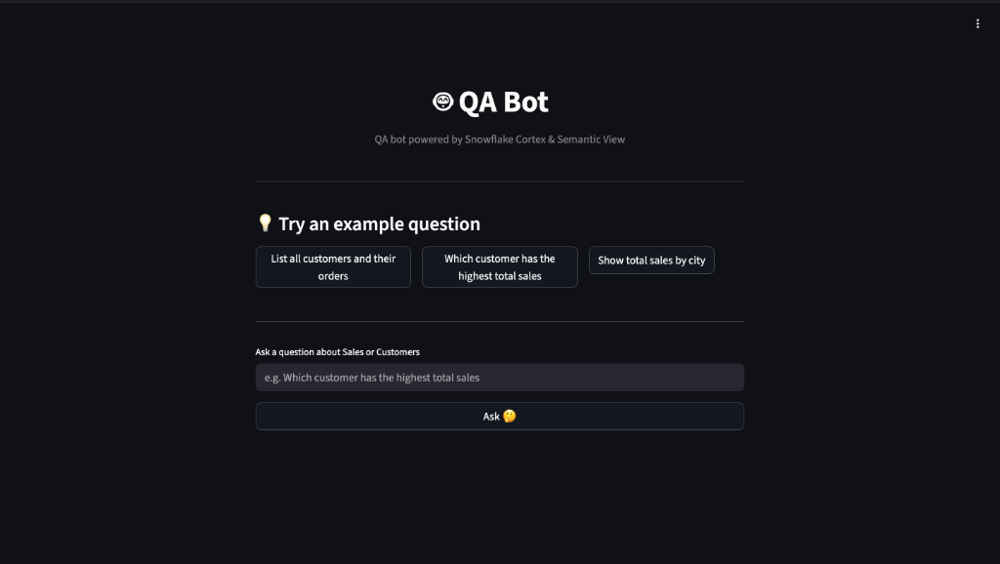
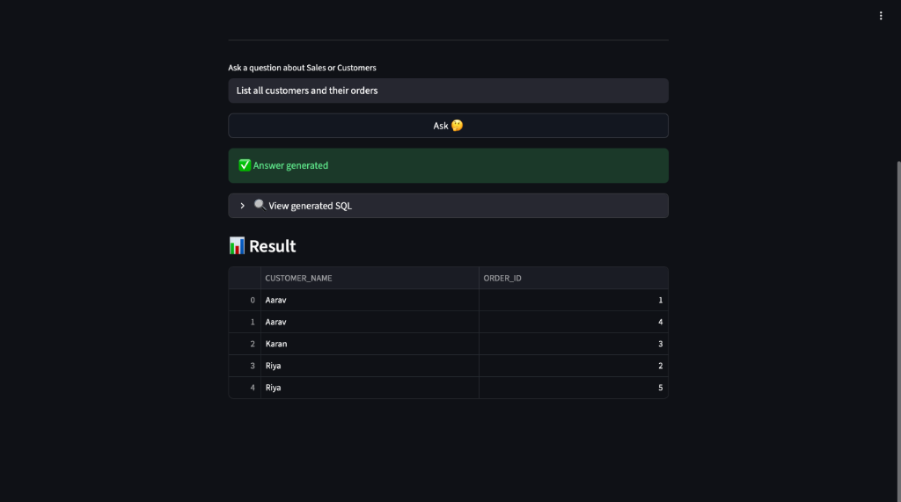

# 🤖 QA Bot

QA Bot is a powerful application powered by **Snowflake Cortex** and **Semantic View**. It allows users to ask natural language questions about their Sales and Customers data and get accurate SQL queries and results in return.

**Live Demo:** [https://snowflake-streamlit.onrender.com](https://snowflake-streamlit.onrender.com)

---

## 📸 Screenshots

| Initial View | Generated Result |
|:---:|:---:|
|  |  |

---

## ✨ Features

*   **Natural Language Queries**: Ask questions like "Which customer has the highest total sales?" or "List all customers and their orders".
*   **Intelligent SQL Generation**: Utilizes **Snowflake Cortex** to translate natural language into optimized SQL queries.
*   **Semantic Model Understanding**: enhancing accuracy by understanding relationships between Customers, Sales, and Orders.
*   **Interactive UI**: Built with **Streamlit** for a smooth and responsive user experience.
*   **Example Questions**: One-click example questions to get started quickly.

## 🛠️ Tech Stack

*   **Frontend**: [Streamlit](https://streamlit.io/)
*   **Data Platform**: [Snowflake](https://www.snowflake.com/)
*   **AI/ML**: Snowflake Cortex (using `snowflake-arctic` model)
*   **Language**: Python 3.8+

## 🚀 Setup & Installation

### Prerequisites

*   Python 3.8 or higher installed.
*   A Snowflake account with access to Cortex functions.

### Installation

1.  **Clone the repository:**
    ```bash
    git clone <your-repo-url>
    cd qa-agent
    ```

2.  **Install dependencies:**
    ```bash
    pip install -r requirements.txt
    ```

3.  **Set up Environment Variables:**
    You need to configure your Snowflake credentials. You can set them as environment variables in your terminal or create a `.env` file (if you add `python-dotenv` to requirements).

    Required variables:
    *   `SNOWFLAKE_ACCOUNT`
    *   `SNOWFLAKE_USER`
    *   `SNOWFLAKE_PASSWORD`
    *   `SNOWFLAKE_ROLE`

### Running the App

Run the Streamlit application using the following command:

```bash
streamlit run app.py
```

## 📝 Usage

1.  Launch the application.
2.  Type a question in the input box (e.g., "Show total sales by city") or select one of the example questions.
3.  Click the **Ask 🤔** button.
4.  View the generated SQL query and the resulting data table.

---
*Powered by Snowflake Cortex*
